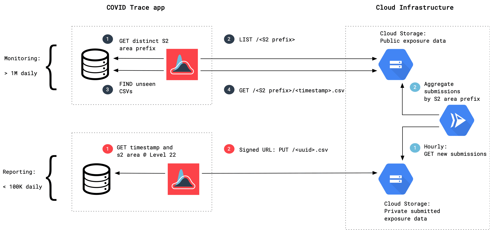

# covidtrace/aggregator

Aggregator handles processing raw COVID Trace input files (locations or
tokens/beacons) to produce anonymized public data. Aggregator also handles generating
query hints when directories in the public data bucket grow larger than a
predefined threshold. These hints allow the app to better control data usage.

## Diagram



## Details

The COVID Trace app has symptomatic users upload CSV files directly to input
buckets. There are two types of files: location files and token/beacon files.
Location files contain a unix timestamp rounded up to the hour, an S2 Geometry
Cell ID, and a verified status (which is currently always set to false). Token
files contain a unix timestamp rounded up to the hour, a beacon UUID, and an
S2 Geometry Cell ID.

Published files contain aggregated and anonymized input data at various S2
Geometry Cell ID levels. Files are aggregated at different S2 Cell ID levels to
allow clients to control data usage. In particular, higher S2 Geometry Cell ID
levels are *more specific* and thus will contain fewer data points.

## Jobs

The following jobs are performed periodically by the Aggregator.

### Aggregate Locations

Fetch and aggregate all location input files, producing several output files.

### Aggregate Tokens

Fetch and aggregate all token/beacon input files, producing several output
files.

### Hinting

List all prefixes in the published data bucket, then recursively compute the
size of each prefix. If the size of a particular prefix exceeds a theshold,
create a `0_HINT` file that indicates to clients that they should subdivide
queries for that prefix into more specific queries.

## Deploying

Aggregator is deployed as a Google Cloud Run service that is triggered by
several Cloud Scheduler jobs at different intervals. The Aggregator is
controlled by environment variables and a configuration file.

```
HINTING_THRESHOLD="number of bytes at which a prefix will be subdivided"
GOROUTINE_LIMIT="max number of goroutines to spawn when interacting with Cloud Storage"
CONFIG_FILE="URL to config file"
```